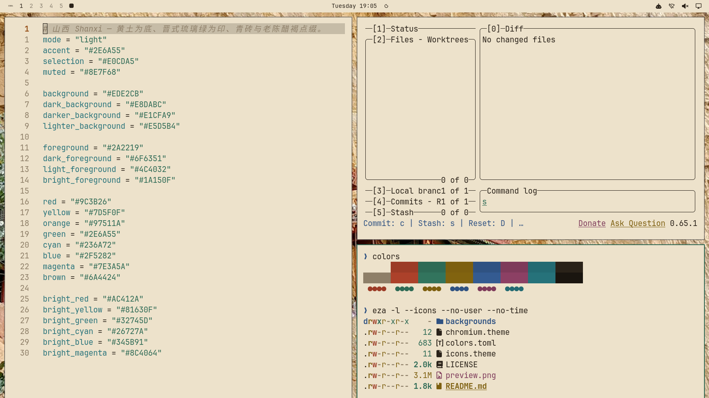

# 山西 Shanxi

黄土为底、晋式琉璃绿为印、青砖与老陈醋褐点缀的浅色主题。壁纸：悬空寺、应县木塔、壶口瀑布、云冈石窟、晋祠、晋剧。



## 安装

```bash
omarchy theme install https://github.com/rwanglq-ctrl/omarchy-shanxi-theme
```

## 壁纸来源

1. [悬空寺](https://unsplash.com/photos/brown-and-black-wooden-temple-etGv_yTBvh0) — Snowscat，Unsplash License（Unsplash）
2. [应县木塔（仰视）](https://unsplash.com/photos/ancient-wooden-pagoda-and-white-statue-against-blue-sky-AzAMjRk2luU) — X F，Unsplash License（Unsplash）
3. [Hukou Waterfall.jpg](https://commons.wikimedia.org/wiki/File:Hukou_Waterfall.jpg) — Leruswing，CC BY-SA 3.0（Wikimedia Commons）；已裁切、缩放
4. [20230609 Cave 20 of Yungang caves.jpg](https://commons.wikimedia.org/wiki/File:20230609_Cave_20_of_Yungang_caves.jpg) — Yumeto，CC BY-SA 4.0（Wikimedia Commons）；已裁切、缩放
5. [云冈石窟大佛](https://unsplash.com/photos/a-statue-of-a-person-ONBBzsOCZLM) — Young Kane，Unsplash License（Unsplash）
6. [晋祠圣母殿侧面.jpg](https://commons.wikimedia.org/wiki/File:%E6%99%8B%E7%A5%A0%E5%9C%A3%E6%AF%8D%E6%AE%BF%E4%BE%A7%E9%9D%A2.jpg) — Patrick20242023，CC BY-SA 4.0（Wikimedia Commons）；已裁切、缩放
7. [晋祠水镜台正面.jpg](https://commons.wikimedia.org/wiki/File:%E6%99%8B%E7%A5%A0%E6%B0%B4%E9%95%9C%E5%8F%B0%E6%AD%A3%E9%9D%A2.jpg) — Patrick20242023，CC BY-SA 4.0（Wikimedia Commons）；已裁切、缩放
8. [烂柯山下220040.jpg](https://commons.wikimedia.org/wiki/File:%E7%83%82%E6%9F%AF%E5%B1%B1%E4%B8%8B220040.jpg) — Augoustoshai，CC BY-SA 4.0（Wikimedia Commons）；已裁切、缩放

## 许可

- 壁纸：Wikimedia Commons 照片按各自 CC 许可署名，改编版以 CC BY-SA 4.0 提供；Unsplash 照片依 Unsplash License 使用
- 配色与配置文件：MIT

详见 [LICENSE](LICENSE)。
